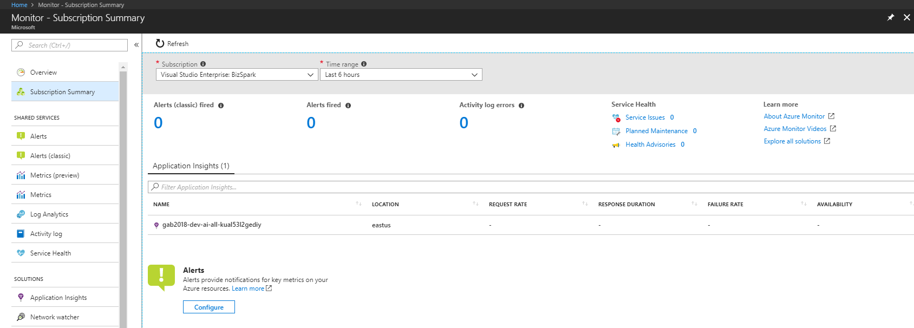
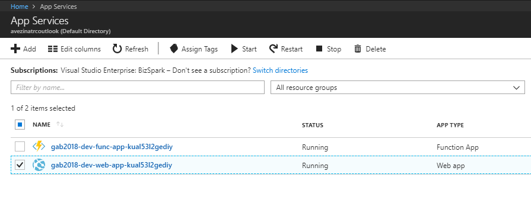
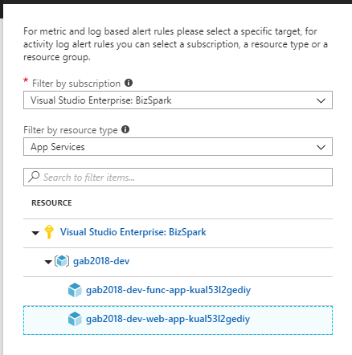
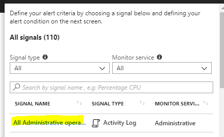
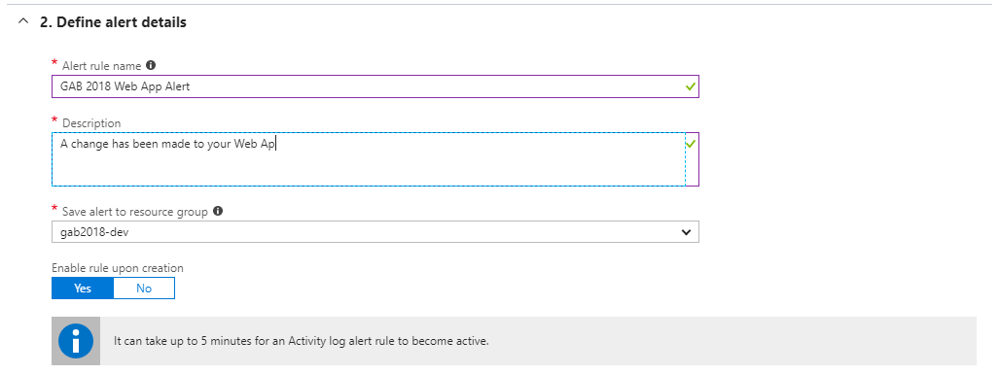
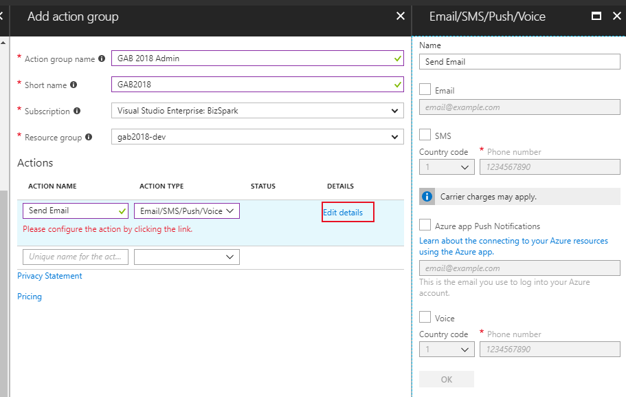

![gablogo][gablogo]

# Explore monitoring and troubleshooting with Azure Monitor

Azure Monitor is a landing page that helps users to have a better visibility into the performance, health and states of Azure resources.

During this session, you will learn how to use Azure Monitor to perform troubleshooting. You will understand how Azure Monitor can help you to have a better visibility into anything that can impact your app availability and performance.

We will show you how you can use Azure monitor to stay on top of things by generating notifications when a degradation happens. Because no matter what you do, it always happens.

## Inside Azure Monitor

Azure monitor has been around for a while now. Before this, existing services were implementing their own method of capturing and displaying metrics. Some services were better than others and there was a very inconsistent approach. Azure Monitor was created as a means to provide a consistent way for resources (both IaaS and PaaS) to collect metrics and provide access to them.

Azure monitor on its own provides a great solution if you are looking for either point in time, or short time scale metrics for a single resource. If you're having an issue with a web app and you want to go and look at its performance metrics, you can do this through Azure Monitor using the portal and see some great charts about what is happening now.

Where this falls down is where you want to be able to monitor multiple resources. If you want to look across your estate of 100 web apps and determine which is using the most memory then this is going to be a very arduous task working with each site individually. This where Log Analytics comes handy as we saw in the previous step.


At the heart of Azure Monitor is a telemetry pipeline that connects to your Azure services. And there are over 30 services that you can pull data from now. And the list keeps growing.

# Walkthrough

In the portal, navigate to All services and find the Monitor option. Click the star icon to add this option to your favorites list so that it is always easily accessible from the left-hand navigation bar.


Click the Monitor option to open up the Monitor page. This page brings together all your monitoring settings and data into one consolidated view. First open the **Subscription Summary** section. The summary shows you a rollup of all monitoring alerts, errors, and service health advisories that relate to resources in your subscription.



## Azure Monitor has 3 categories of monitoring data

* Activity logs
* Diagnostic logs
* Metrics

## Part 1 - Activity Logs


The activity log describes all operations performed on resources in your subscription. Using the Activity Log, you can determine the ‘what, who, and when’ for any create, update, or delete operations on resources in your subscription. For example, the Activity Log tells you when a web app was stopped and who stopped it. Activity Log events are stored in the platform and available to query for 90 days.

The Azure Activity Log is primarily for activities that occur in Azure Resource Manager. It does not track resources using the Classic model.

You can retrieve events from your Activity Log using the Azure portal, CLI, PowerShell cmdlets, and Azure Monitor REST API.

The Activity Log contains several categories of data:

* **Administrative** - This category contains the record of all create, update, delete, and action operations performed through Resource Manager. Examples of the types of events you would see in this category include "create virtual machine" and "delete network security group".

* **Service Health** - This category contains the record of any service health incidents that have occurred in Azure. An example of the type of event you would see in this category is "SQL Azure in East US is experiencing downtime." Service health events come in five varieties: Action Required, Assisted Recovery, Incident, Maintenance, Information, or Security, and only appear if you have a resource in the subscription that would be impacted by the event.

* **Alert** - This category contains the record of all activations of Azure alerts. An example of the type of event you would see in this category is "CPU % on myVM has been over 80 for the past 5 minutes."

* **Autoscale** - This category contains the record of any events related to the operation of the autoscale engine based on any autoscale settings you have defined in your subscription. An example of the type of event you would see in this category is "Autoscale scale up action failed."

* **Recommendation** - This category contains recommendation events from certain resource types, such as web sites and SQL servers. These events offer recommendations for how to better utilize your resources. You only receive events of this type if you have resources that emit recommendations.

* **Security** - This category contains the record of any alerts generated by Azure Security Center. An example of the type of event you would see in this category is "Failed login for the user".

### What can you do with Activity log


* Query and view it in the **Azure portal**.
* Create an alert on an Activity Log event.
* Stream it to an **Event Hub** for ingestion by a third-party service or custom analytics solution such as PowerBI.
* Analyze it in PowerBI using the **PowerBI content pack**.
* Save it to a **Storage Account** for archival or manual inspection. You can specify the retention time (in days) using the Log Profile.
* Query it via PowerShell Cmdlet, CLI, or REST API.

### Part 1 Lab - Who stop your Web App

**Prerequisite:** Stop your website

* Step 1 : In the portal, navigate to **App Service Plan**
* Step 2: Select your Web App and click **STOP** on the top of the screen



**Scenario**: Your Web App doesn't serve requests anymore. You realize that your Web App was stopped. You are suspecting that during the last deployment, one of your onsite technicians has stopped the Web App accidentally.

**Goal:** Query the Activity Log using the Azure portal to identify when and who stopped your Web App

* Step 1 : Go on Azure portal and choose the Azure Monitor landing page
* Step 2: Select Activity log from the navigation pan
* Step 3: Set your filter to Resource type: *App Services** and Operation: **Stop Web App (sites)**, then apply
* Step 4: Observe : Your WebSite was stopped on [date] by [user].


Take two minutes to understand what are the available filters and options when qeury using the Azure Portal.

* Save queries
* Export result as CSV
* Export your activity logs to a storage or Event hub
* Export to Log Analytics for a more inteligent search capabilities ( see [Getting Started with Queries](https://docs.loganalytics.io/docs/Learn/Cheat-sheets/Legacy-to-new-to-Azure-Log-Analytics-Language))
* Add an activity log alert directly from a result set
* Pin your saved query to the a dashboard

## Part 2 - Alerts

You can receive an alert based on metrics or events of your Azure services.

* **Metric values** - The alert triggers when the value of a specified metric crosses a threshold you assign in either direction. That is, it triggers both when the condition is first met and then afterwards when that condition is no longer being met.
* **Activity log events** - An alert can be triggered on every event, or, only when certain event occurs.

You can configure a classic metric alert to do the following when it triggers:

* Send email notifications to the service administrator and co-administrators
* Send email to additional emails that you specify.
* Call a webhook
* Start execution of an Azure runbook (only from the Azure portal)

Azure Monitor now supports a new metric alert type. The newer alerts differ from classic metric alerts in a few ways:

* **Improved latency**: Newer metric alerts can run as frequently as every one minute. Older metric alerts always run at a frequency of 5 minutes. Log alerts still have a longer than 1 minute delay due to the time is taken to ingest the logs.
* **Support for multi-dimensional metrics**: You can alert on dimensional metrics allowing you to monitor on only an interesting segment of the metric.
* **More control over metric conditions**: You can define richer alert rules. The newer alerts support monitoring the maximum, minimum, average, and total values of metrics.
* **Combined monitoring of multiple metrics**: You can monitor multiple metrics (currently, up to two metrics) with a single rule. An alert is triggered if both metrics breach their respective thresholds for the specified time-period.
* **Better notification system**: All newer alerts use action groups, which are named groups of notifications and actions that can be reused in multiple alerts. Classic metric alerts and older Log Analytics alerts do not use action groups.
* **Metrics from Logs (limited public preview)**: Log data going into Log Analytics can now be extracted and converted into Azure Monitor metrics and then alerted on just like other metrics.

### Part 2 Lab - Generate an alert when an update is done to your Web App

**Scenario**: In the previous lab we saw how easy it is to use the activity log to monitor changes in our Azure resources. Let's now generate an Alert when an update is done to your Web App.

**Goal:** Generate an alert when an update is done to your Web App

* Step 1: From the navigation pane in Azure Monitor, select **Alert**
* Step 2: Using the top menu, click **+ New Alert Rule**
* Step 3: Select your App Service as the target of your alert.

  

* Step 4: Use **All Administrative operations** as criteria.

  

* Step 5: Type a name and a description for your alert. ex: **GAB 2018 Web App Alert** and **A change has been made to your Web App**



* Step 6: Use the Action Group generated in the previous step ( or create a new one)

  

* Step 7: Review your alert definition and save. Note: Alert could take around 5 minutes to be activated.
* Step 8: Let's now start back your Web App.

  This last step should generate an alert to your action group.

  

  You can also review fired alerts in the Alert section of Azure Monitor.

  

## Part 3 - Metrics and Dashboard

Azure Monitor enables you to consume telemetry to gain visibility into the performance and health of your workloads on Azure. The most important type of Azure telemetry data is the metrics (also called performance counters) emitted by most Azure resources. Azure Monitor provides several ways to configure and consume these metrics for monitoring and troubleshooting.

Metrics have the following characteristics:

* All metrics have one-minute frequency (unless specified otherwise in a metric's definition). You receive a metric value every minute from your resource, giving you near real-time visibility into the state and health of your resource.
* Metrics are available immediately. You don't need to opt in or set up additional diagnostics.
* You can access 90 days of history for each metric. You can quickly look at the recent and monthly trends in the performance or health of your resource.
* Some metrics can have name-value pair attributes called dimensions. These enable you to further segments and explore a metric in a more meaningful way.

### LAB 3 - View the performance of your Web App in a single glance.

**Scenario**: You want to make sure that your website is up and deliver the best performance at all time. You want to be able to quickly understand what is the current status of your Web App.

**Goal:** Create a custom dashboard using metrics.

* Step 1: Create a new dashboard

A single dashboard can contain resources from multiple applications, resource groups, and subscriptions. 

1.On the main screen of the portal, select New dashboard.

  
2.Type a name for the dashboard example: "GAB 2018 Web App"
3.Click **Done** customizing at the top of the screen to exit tile customization mode and then **Publish** changes to save your changes.

* Step 2: Number of request per hour

  1. In the Azure Portal, click Azure Monitor, and then Metrics (Preview).
  2. Select your Web App in ....

* Step 3: Average execution time per request per hour

  1. In the Azure Portal, click Azure Monitor, and then Metrics (Preview).
  2. Select your Web App in....

* Step 4: Pin to your dashboard

## Part 4 - Diagnostics Settings

Resource diagnostic logs for non-Compute resources are configured using resource diagnostic settings.

* Where resource diagnostic logs and metrics are sent (Storage Account, Event Hubs, and/or OMS Log Analytics).
* Which log categories are sent and whether metric data is also sent.
* How long each log category should be retained in a storage account
* A retention of zero days means logs are kept forever. Otherwise, the value can be any number of days between 1 and 2147483647.
* If retention policies are set but storing logs in a Storage Account is disabled (for example, if only Event Hubs or OMS options are selected), the retention policies have no effect.
* Retention policies are applied per-day, so at the end of a day (UTC), logs from the day that is now beyond the retention policy are deleted. For example, if you had a retention policy of one day, at the beginning of the day today the logs from the day before yesterday would be deleted.

## Part 5 - Service Health

Service Health is your personalized dashboard in the Azure Portal for receiving notifications when Azure service issues, update or planned maintenance that could affect your resources.

## Final Lab - Get smarter alerts with Logic App

**Scenario**:You should receive two emails alert when a metric reach it's configured limits. One when it gets activated and another one when the metric is back under normal value. Receiving too many emails for alerts can be annoying and also the basic email alert template doesn't tell you much information on the current situation.


**Goal:** Generate a smarter alert email with Logic App

* Step 1 : Create an Application Insights API Key

  ![Create API Key][CreateAPIKey]
  
  * From the Application Insights blade, select the API Access option from the left menu.
  * Click the Create API Key, on the top of the screen. 
  * Enter a description an check the Read Telemetry option before clicking the Generate key blue button.
  * **Note the Application ID and the API Key**, we will need those soon.

  ![Get API Key][GetAPIKey]

* Step 2 : Create a Logic App

  * Click the Create a resource button found on the upper left-hand corner of the Azure portal.
  * Search for and select Logic App. Click the Create button.
  * Enter the name myLogicApp and select your existing Resource Group. Use your subscription. Use the default location. Check the Pin to Dashboard option. When complete, click Create. ![Create a Logic App][CreateLogicApp]

  * The logic app should be pinned to your dashboard. Navigate to the logic app by clicking on it.

* Step 3: Design Your Logic App

  * By clicking on the Logic App it should open directly in *Edit* mode, because it's a new one. 
  * We need to select a trigger. Logic Apps can connect to many different services but for this demo we will use the `HTTP Trigger`. Select the trigger named: When a HTTP request is received. 

  ![Selec Http Trigger][SelectHttpTrigger]

  * In the *Request Body JSON Schema* copy paste the content of the file `LogicApp-Request-Schema.json` available [here](./LogicApp-Request-Schema.json). This schema is generated from some requests received by the Logic Apps. We will get back to it later.
  * Click the button `+ New step`, Then Add an action. 
  
  ![Add New Step][AddNewStep]

  * We want an action related to our Application Insights, so enter "Application Insights into the search box. Then select the action that contain "Visualize Analytics query". 
  
  ![Select View Analytics][ViewAnalytics]

  * Remeber those Application ID an API Key? It's now time to use them. Fill-up the authentification form. 
  
  ![Enter Keys][EnterKeys]

  * Now let's add our a query. You could copy paste the query provieded here, or in another browser go to: https://analytics.applicationinsights.io create another one.

  ```
  exceptions
  | top 10 by timestamp desc nulls last
  | project timestamp, type, method, outerMessage, customDimensions, customMeasurements

  ```

  Once the query is in select Html Table from the Chart Type list.

  ![Query and HTML table][Query_and_THMLtable]

  * Add a `Send an Email` step. You can you Outlook.com or another one.
  * Enter your email address and a Suject.
  * For the body Enter some simple HTML and use the Dynamic content box to add elements from the query result or from the Trigger. For exemple you could use this HTML:

  ```
  <h1>Something went wrong</h1>
  <p>Application Insights <b>   </b> as been triggered <br></p>

  <p>The metric <b>   </b> got greater than the expect limit</p>

  <h2>Here the top 10 if the last Exceptions</h2>

  <br>
  <p>Link to the portal:   </p>

  ```

  And inject those element in it: `Name`, `MetricName`, `Body`, `PortalLink`
  
  ![email body][emailbody]

  * Click on the **Show advance options** and set Is HTML to Yes.
  * Don't forget to Save.
  
* Step 4: Set the Binding
  Now we will create an alert and bind our Logic App to it.
  * From the Application Insights blade, Select the Alert option. Then click on *Add metric alert* on the top of the screen.
  * Give a name and description to your Alert.
  * Validate that the good Subscription, Resource group are selected.
  * In the Resource we need to select our web application. Select the resource starting by: `gab2018-dev-web-app`
  * In Metric you select many deferrent options. For this demo, we will use `Http Server Errors`.
  * Now we need to set the condition that will make our alert to get triggered. In Condition select `Greater than`, threshold a value between 2 and 5. 
  * The only thing missing is the binding to our Logic Apps. Click on the Take Action *Run a logic app from this alert* buttin.
  * Select **Enabled**.
  * Select your subscription where the Logic App is. Then select your Logic App.
  * Click the *OK* button... twice.
  * Once the you received the notification that your alert is Successfully created, you will be done.


* Step 5: Test
  * Now the easy part. Navigate to the web application an generate a few error. You can do that easily by navigating to the page **Let's crash**.
  * Once you generate enought exception. Be patient, it will takes a few minutes,  and check your e-mail.


## End
[Previous Step](../Step7/README.md)
[Next Step](../Step9/README.md)

## Reference
* [Monitoring Overview](https://docs.microsoft.com/en-us/azure/monitoring-and-diagnostics/monitoring-overview)
* [Azure Monitor Get-Started](https://docs.microsoft.com/en-us/azure/monitoring-and-diagnostics/monitoring-get-started)
* [Overview of Azure Monitor](https://docs.microsoft.com/en-us/azure/monitoring-and-diagnostics/monitoring-overview-azure-monitor)
* [View activity logs to audit actions on resources](https://docs.microsoft.com/en-us/azure/azure-resource-manager/resource-group-audit)


* [Create and share dashboards in the Azure portal](https://docs.microsoft.com/en-us/azure/azure-portal/azure-portal-dashboards)
* [The next generation of Azure Alerts has arrived](https://azure.microsoft.com/en-us/blog/the-next-generation-of-azure-alerts-has-arrived/)
* [Azure Monitor–General availability of multi-dimensional metrics APIs](https://azure.microsoft.com/en-us/blog/azure-monitor-general-availability-of-multi-dimensional-metrics-apis/)
* [Supported metrics with Azure Monitor](https://docs.microsoft.com/en-us/azure/monitoring-and-diagnostics/monitoring-supported-metrics)
* [Monitor Subscription Activity with the Azure Activity Log](https://docs.microsoft.com/en-us/azure/monitoring-and-diagnostics/monitoring-overview-activity-logs)
* [Azure Monitor Pricing](https://azure.microsoft.com/en-us/pricing/details/monitor/)
* [Azure diagnostic logs](https://docs.microsoft.com/en-us/azure/cdn/cdn-azure-diagnostic-logs)


[gablogo]: ../media/logo-2018-500x444.png "Global Azure Bootcamp logo"
[CreateAPIKey]: Media/CreateAPIKey.png
[GetAPIKey]: Media/GetAPIKey.png
[CreateLogicApp]: Media/CreateLogicApp.png
[SelectHttpTrigger]: Media/SelectHttpTrigger.png
[AddNewStep]: Media/AddNewStep.png
[ViewAnalytics]: Media/ViewAnalytics.png
[EnterKeys]: Media/EnterKeys.png
[Query_and_THMLtable]: Media/Query_and_THMLtable.png
[emailbody]: Media/emailbody.png